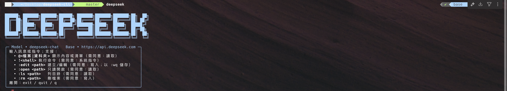

# DeepSeek CLI

[中文](README.md) | [English](README.en.md)



DeepSeek CLI 是一個命令列工具，提供 **與 DeepSeek 模型對話** 的能力，並且內建支援以下功能：
- **安全授權機制**：執行任何系統指令或檔案讀寫前，都會詢問使用者同意。
- **聊天模式**：與 DeepSeek 模型直接互動，支援 `deepseek-chat` 與 `deepseek-reasoner`。
- **檔案與目錄操作**：可使用 `@檔案/資料夾` 或指令（`:edit`、`:open`、`:ls`、`:rm`）來檢視與管理檔案。
- **系統指令執行**：可直接在 REPL 中輸入 `!命令`，像在終端機中執行指令。
- **Tab 補全**：支援路徑與檔案名稱的自動補全，提升操作便利性。

---

## 🚀 安裝方式

```bash
# 下載專案
git clone https://github.com/MarkLo127/deepseek-cli.git
cd deepseek-cli

# 安裝
pip install -e .
```

## 🏁 快速開始

```bash
deepseek
```